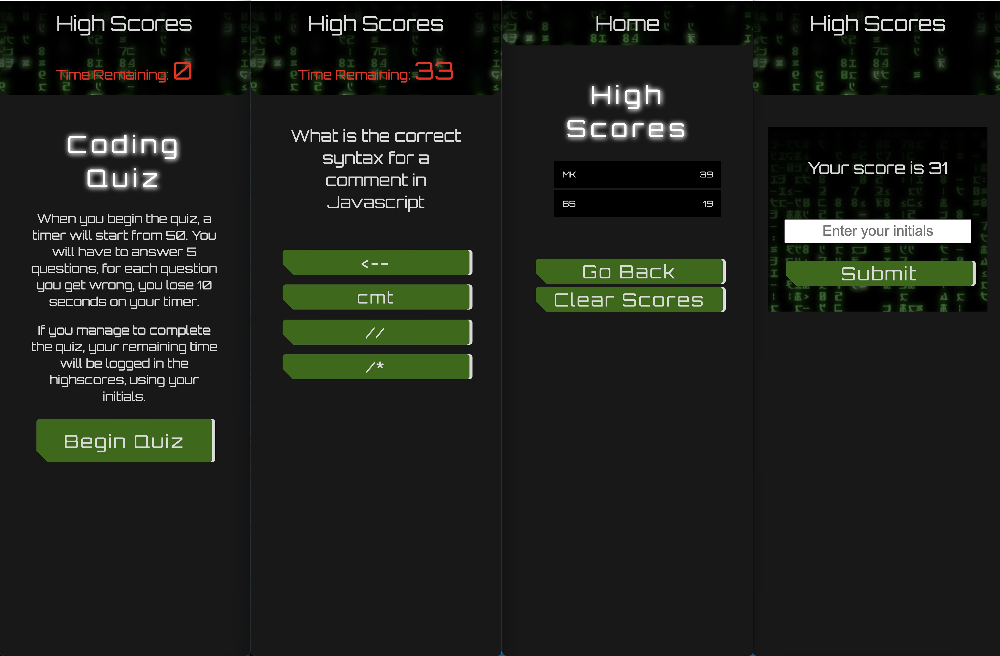

# Code Quiz

## Description

A quiz testing coding skills using HTML, CSS and Javascript with a timer that deducts points when a user gets a question wrong.

## GitHub Pages Link

Repository - https://github.com/Mattrix01/Timed-quiz/tree/dev

Deployment link: https://mattrix01.github.io/Timed-quiz/

## Technologies Used

- HTML
- CSS styling
- Flex-boxes
- CSS variables
- Typography
- Media queries
- Pseudo classes
- Javascript
- Web API's
- Local Storage
- Dynamic HTML

## Application Flow

- When you click on the Begin Quiz button

  - Timer Starts
  - Renders the first question on the page

- When user clicks/selects an answer
  - checks if the selected answer is correct
    - if answers is wrong then subtract x seconds from the timers time remaining and renders next question
    - if answer is correct then render the next question
      - if the question is the last question then display score
- If met with highscores page and not gameover render
  - input your initials to be scored in local storage and displayed on highscores page.

## Steps taken

- I firstly setup an array containing objects for my questions and asnwers to use later in javscript.

- Then I set up all my html documents, CSS and javascript files and folders.

- I linked up all my pages and found a font I liked and imported it.

- I setup a nav bar and some containers.

- I chose a colour scheme and setup some CSS variables.

- I styled some interesting responsive buttons and a blinking timer.

- Created question container and further styling.

- I put in place some alerts if answers are wrong or correct to user later and styled them.

- I created and styled a form.

- Game over container added to render later via javascript.

- I began setting out pseudocode comments to begin my javascript.

- I made constant console logs to check my connectivity, troubleshooting as I went.

- I created a for loop to grab my questions.

- I setup my questions container to be rendered via javascript.

- I added a timer.

- Made sure my correct and incorrect options were verified.

- Questions I then made render correcly till end of quiz or game over via timeout.

- I rendered my alerts via javascript that I made earlier.

- Rendered highscores.

- Rendered gameover container.

- I made some tweaks and question changes.

- I set up score to be written into local storage.

- I set up the html for my highscores document and styling.

- Rendered my highscores onto page.

- Set up buttons to clear local storage.

- Removed console logs and any other things that are not eneded for my final commit and deployment.

## web page screenshot

